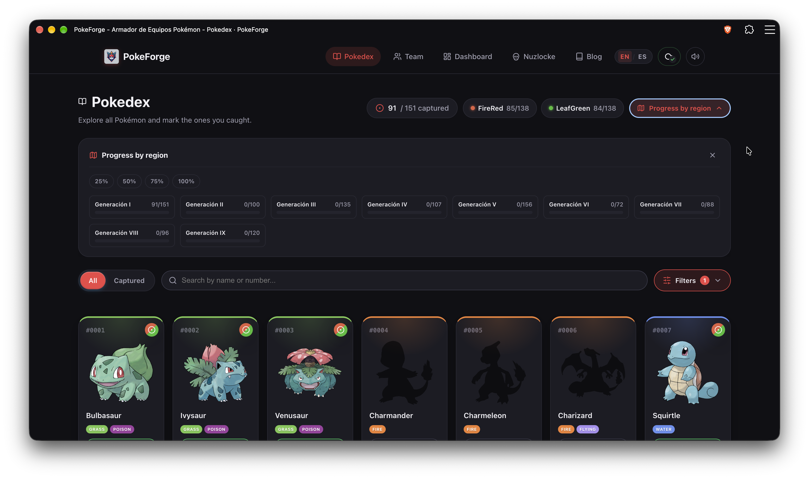
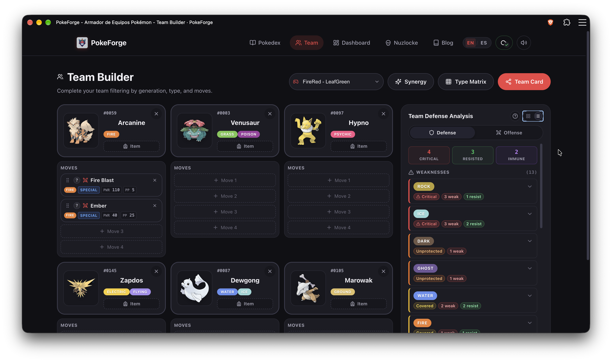
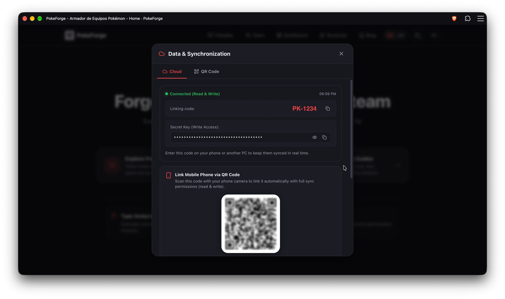

# PokeForge

PWA para registrar tus capturas Pokémon por versión, armar equipos con análisis de tipos y consultar la Pokédex completa desde cualquier dispositivo, incluso sin conexión.

**Demo:** https://pokeforges.netlify.app



| Team Builder | Sincronización entre dispositivos |
| --- | --- |
|  |  |

## Por qué existe

Suelo comprar las dos versiones de cada juego de Pokémon para completar la Pokédex, y llevar el registro global se volvía un lío: qué Pokémon tengo, en cuál versión, qué equipo armé y qué movimientos aprende cada uno. PokeForge nació para tener ese registro a mano en cualquier lugar, con mis equipos y capturas siempre sincronizados.

## Qué hace

- **Pokédex** con más de 1025 Pokémon (Gen I a IX), filtros por juego y generación, registro de capturas por versión y progreso por región.
- **Team Builder** para armar equipos de 6 con movimientos y objetos, análisis defensivo y ofensivo (críticos, resistidos, inmunes), Type Matrix, Synergy y Team Card.
- **Buscador de movimientos** con filtros combinables (ver más abajo).
- **Modo Nuzlocke**, **dashboard** y **blog** con guías y análisis.
- **PWA instalable**: funciona offline, abre a pantalla completa y carga rápido.
- **Sincronización en la nube sin cuentas** (ver más abajo).
- Interfaz en **español e inglés**, sin anuncios.

### Filtros del buscador de movimientos

Podés escribir el nombre de un movimiento o combinar etiquetas separadas por espacios:

| Etiqueta | Qué filtra | Ejemplos |
| --- | --- | --- |
| `tipo:` / `type:` / `t:` | Tipo elemental. Coma para "o", `!` o `-` para negar | `type:fire`, `type:grass,ice`, `!type:normal` |
| `categoria:` / `category:` / `cat:` / `c:` | Física, especial o estado | `cat:special`, `!cat:status` |
| `potencia:` / `power:` / `pow:` / `pot:` | Potencia, con `=`, `>`, `>=`, `<`, `<=` o `null` | `power:>30`, `pow:>=90`, `power:null` |
| `pp:` / `puntos:` | Puntos de poder | `pp:10`, `pp:>=30` |
| `precision:` / `accuracy:` / `acc:` | Precisión | `accuracy:100`, `acc:>80` |
| `metodo:` / `method:` / `m:` y `nivel:` / `level:` / `lvl:` | Cómo y cuándo lo aprende (nivel, MT, tutor, huevo) | `method:tm`, `level:<=25` |

Combinados: `type:fire pow:>80 cat:special` o `type:water !cat:status pow:>=90`.

## Sincronización sin cuentas

La idea de partida fue: *"quiero ver mis datos en cualquier lugar, pero que sigan siendo privados"*.

- Tus datos se guardan como texto, **localmente** (para seguir usando la app sin internet) y en una **copia en la nube** (vault).
- La copia en la nube se guarda y consulta en [Turso](https://turso.tech) (libSQL) cuando está configurado (ver [Variables de entorno](#variables-de-entorno)).
- Cada vault tiene un **código de vinculación** y una **clave secreta**.
- Con el código, otro dispositivo se conecta en **modo solo lectura**. Si además tiene la clave secreta, obtiene **permiso de escritura**.
- El **QR** comparte el código junto con la clave para vincular un celular en un paso.
- Un Web Worker revisa periódicamente si hay cambios y hay guardado automático.
- También podés exportar e importar un respaldo en JSON.

**Qué aprendí:** al escanear el QR, los datos se descargaban pero después no se reflejaban los cambios hechos en otros dispositivos. Lo resolví haciendo que la nube sea siempre la fuente de verdad cuando hay conexión y dejando el caché local solo como respaldo sin internet. Parece un detalle menor, pero me llevó mucho tiempo darme cuenta de que el problema estaba en quién manda cuando hay dos versiones de los datos.

## Stack

| Área | Tecnología |
| --- | --- |
| Framework | [Astro](https://astro.build) 7 + TypeScript |
| Despliegue | Netlify |
| Datos de Pokémon | [PokeAPI](https://pokeapi.co) |
| Copia en la nube | [Turso](https://turso.tech) (libSQL, con `@libsql/client`) |
| UI y utilidades | anime.js, lucide, TanStack Table, qrcode, html-to-image |
| Calidad | Playwright (e2e), ESLint, Prettier |

Carga de datos: los datos de Pokémon se descargan de PokeAPI con el script `fetch:pokedex` y se guardan como archivos estáticos en `public/data/`. Además, se usa un caché básico para las primeras entradas de la Pokédex y el resto de las peticiones se cachea de forma progresiva a medida que se usa la app.

## Primeros pasos

Requiere Node.js 22.12 o superior y [pnpm](https://pnpm.io).

```bash
pnpm install
pnpm dev        # http://localhost:4321
pnpm build
pnpm preview
```

### Variables de entorno

La sincronización en la nube usa una base de datos de [Turso](https://turso.tech). Para activarla, creá un archivo `.env` en la raíz del proyecto:

```bash
TURSO_DATABASE_URL=libsql://tu-base.turso.io
TURSO_AUTH_TOKEN=tu_token
```

| Variable | Qué es |
| --- | --- |
| `TURSO_DATABASE_URL` | URL de tu base de datos de Turso |
| `TURSO_AUTH_TOKEN` | Token de autenticación para esa base |

**Son opcionales.** Sin ellas la app funciona igual con tus datos guardados localmente en el navegador, pero la sincronización entre dispositivos no está disponible, porque los datos de los vaults se guardan en Turso.

En producción (Netlify), cargalas como variables de entorno del sitio. Asegurate de que `.env` esté en `.gitignore` y no subas tus credenciales al repositorio.

### Scripts

| Script | Qué hace |
| --- | --- |
| `pnpm test` | Tests |
| `pnpm test:e2e` | Tests end-to-end con Playwright |
| `pnpm test:e2e:ui` | Playwright con interfaz visual |
| `pnpm test:all` | Todos los tests |
| `pnpm check` | Chequeo de tipos de Astro |
| `pnpm lint` / `pnpm lint:fix` | Análisis estático con ESLint |
| `pnpm format` / `pnpm format:check` | Formato con Prettier |
| `pnpm fetch:pokedex` | Descarga, procesa y guarda localmente los datos de Pokémon desde PokeAPI en `public/data/` (con `pnpm fetch:pokedex:force` se fuerza la descarga) |

## Estructura

```
.github/workflows/   CI
docs/                documentación y capturas
e2e/                 tests end-to-end (Playwright)
public/              assets estáticos y datos de la Pokédex (public/data/)
scripts/             scripts de utilidad
src/                 código de la aplicación
tests/               tests
```
