We all remember the golden era of **Pokémon FireRed & LeafGreen**. You assembled your dream team, spent hours grinding your Kadabra or Haunter up to level 60 thinking, _"surely it evolves next level!"_, only to confront harsh reality: **Game Freak designed these monsters so you had to talk to other humans in real life**.

And if you weren't wrestling with a flaky Game Boy Advance Game Link Cable that canceled the trade if someone bumped the table, you were probably dealing with the tragedy of buying a Fire Stone at the Celadon Department Store, slapping it onto your level 18 Growlithe immediately, and permanently locking it out of ever learning _Flamethrower_.

In this comprehensive guide, we break down every single Pokémon that evolves through **Trading** and **Evolutionary Stones** in FireRed & LeafGreen, including competitive movesets, item locations, and key pitfalls to avoid.

---

## 1. Trade Evolutions

Trading has been the ultimate test of playground trust since 1996. In FireRed and LeafGreen, trade evolutions come in two varieties: the classic Gen I trade evolutions (no item required) and National Dex evolutions (held item required).

> **Schoolyard Trauma Alert**: We all knew that one classmate who promised to "trade back" your newly evolved Gengar or Machamp, only to hear the recess bell ring and see them vanish into thin air. (The spiritual predecessor to Mindy in Gen 4 and her infamous Everstone-holding Haunter).

### 1.1. Classic Trade Evolutions (No Item Needed)

These four Generation I powerhouses evolve immediately upon being traded to another game cartridge or wireless connection:

<pokemon-showcase>
  <pokemon-card name="Alakazam" level="Trade" types="psychic" compact>
    
  </pokemon-card>

  <pokemon-card name="Machamp" level="Trade" types="fighting" compact>
    
  </pokemon-card>

  <pokemon-card name="Golem" level="Trade" types="rock, ground" compact>
    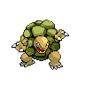
  </pokemon-card>

  <pokemon-card name="Gengar" level="Trade" types="ghost, poison" compact>
    
  </pokemon-card>
</pokemon-showcase>

- **Kadabra ➔ Alakazam**: A pure special sweeper with staggering Special Attack and Speed. In Gen III, elemental punches (Fire Punch, Ice Punch, Thunder Punch) were special attacks, making Alakazam a terrifying coverage cannon.
- **Machoke ➔ Machamp**: Four arms packed with raw physical power. Its _Guts_ ability boosts Attack by 50% when afflicted by status conditions like burn or paralysis.
- **Graveler ➔ Golem**: The quintessential physical tank. An absolute lifesaver against Lt. Surge and Blaine, packing _Explosion_ as the ultimate tactical reset button.
- **Haunter ➔ Gengar**: Blessed with _Levitate_, Gengar completely invalidates its Ground weakness (Earthquake) while boasting three full immunities (Normal, Fighting, Ground).

---

### 1.2. Held Item Trade Evolutions (National Dex Post-Game)

> **Important Rule for FireRed & LeafGreen**: These evolutions belong to the **National Pokédex**. To trigger them in FRLG, you must defeat the Elite Four, own at least 60 caught species in your Pokédex, and deliver the **Ruby** and **Sapphire** gems to Celio on One Island (Sevii Islands) to connect the network with Hoenn. If you attempt to trade a Scyther holding a Metal Coat before unlocking the National Dex, the evolution will mysteriously cancel itself!

<pokemon-showcase>
  <pokemon-card name="Steelix" level="Metal Coat" types="steel, ground" compact>
    
  </pokemon-card>

  <pokemon-card name="Scizor" level="Metal Coat" types="bug, steel" compact>
    
  </pokemon-card>

  <pokemon-card name="Kingdra" level="Dragon Scale" types="water, dragon" compact>
    
  </pokemon-card>

  <pokemon-card name="Politoed" level="King's Rock" types="water" compact>
    
  </pokemon-card>

  <pokemon-card name="Slowking" level="King's Rock" types="water, psychic" compact>
    
  </pokemon-card>

  <pokemon-card name="Porygon2" level="Up-Grade" types="normal" compact>
    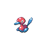
  </pokemon-card>

  <pokemon-card name="Huntail" level="Deep Sea Tooth" types="water" compact>
    
  </pokemon-card>

  <pokemon-card name="Gorebyss" level="Deep Sea Scale" types="water" compact>
    
  </pokemon-card>
</pokemon-showcase>

#### Where to find Trade Evolution items in Kanto & Sevii Islands:

- **Metal Coat**: Five Island (Memorial Pillar) by giving a Lemonade to the grieving Onix trainer (_Tectonix_), or held rarely (5%) by wild Magnemite/Magneton.
- **Dragon Scale**: Icefall Cave (Four Island) on the ground, or held rarely by wild Horsea, Seadra, Dratini, and Dragonair.
- **King's Rock**: Seven Island (Sevault Canyon), or held rarely by wild Poliwhirl/Slowpoke.
- **Up-Grade**: Rocket Warehouse on Five Island.
- **Deep Sea Tooth & Deep Sea Scale**: Transferred from Pokémon Ruby/Sapphire/Emerald via the Abandoned Ship.

---

## 2. Evolutionary Stone Evolutions

Evolutionary stones offer an instant power spike... but harbor a **critical design trap** in Generation III:

> **The Level-Up Moveset Penalty**: In Pokémon FireRed and LeafGreen, nearly all Pokémon evolved via stones **stop learning moves naturally through level-up**.
>
> - Evolving **Pikachu** at level 5 into Raichu means Raichu will never learn _Thunderbolt_, _Agility_, or _Thunder Wave_ naturally.
> - Evolving **Growlithe** before level 49 means Arcanine will never learn _Flamethrower_ on its own (forcing you to grind coins for TM35 at the Rocket Game Corner).
> - **Pro Tip**: Always verify natural learnsets on PokeForge before consuming your evolutionary stones!

### 2.1. Water Stone

Transforms aquatic allies into offensive and defensive powerhouses.

<pokemon-showcase>
  <pokemon-card name="Poliwrath" level="Water Stone" types="water, fighting" compact>
    
  </pokemon-card>

  <pokemon-card name="Cloyster" level="Water Stone" types="water, ice" compact>
    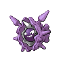
  </pokemon-card>

  <pokemon-card name="Starmie" level="Water Stone" types="water, psychic" compact>
    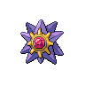
  </pokemon-card>

  <pokemon-card name="Vaporeon" level="Water Stone" types="water" compact>
    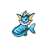
  </pokemon-card>

  <pokemon-card name="Ludicolo" level="Water Stone" types="water, grass" compact>
    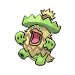
  </pokemon-card>
</pokemon-showcase>

- **Poliwhirl ➔ Poliwrath**: Gains Fighting typing and beefy physical bulk.
- **Shellder ➔ Cloyster**: Sky-high 180 base Defense, plus entry hazards (_Spikes_) and a devastating _Explosion_.
- **Staryu ➔ Starmie**: An elite Kanto sweeper. High speed, great Special Attack, and unrivaled coverage (_Surf_, _Psychic_, _Thunderbolt_, _Ice Beam_).
- **Eevee ➔ Vaporeon**: A premier special sponge boasting 130 base HP.
- **Lombre ➔ Ludicolo (National Dex)**: Rare Water/Grass dual typing that neutralizes mutual weaknesses.

---

### 2.2. Fire Stone

Unleashing blazing fury across Kanto's competitive landscape.

<pokemon-showcase>
  <pokemon-card name="Ninetales" level="Fire Stone" types="fire" compact>
    
  </pokemon-card>

  <pokemon-card name="Arcanine" level="Fire Stone" types="fire" compact>
    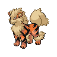
  </pokemon-card>

  <pokemon-card name="Flareon" level="Fire Stone" types="fire" compact>
    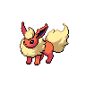
  </pokemon-card>
</pokemon-showcase>

- **Vulpix ➔ Ninetales (LeafGreen Exclusive)**: High Speed paired with disruptive tools like _Will-O-Wisp_ and _Confuse Ray_.
- **Growlithe ➔ Arcanine (FireRed Exclusive)**: Kanto's pseudo-legendary with a massive 555 base stat total and _Intimidate_.
- **Eevee ➔ Flareon**: An insane 130 base physical Attack stat, delivering colossal damage with _Shadow Ball_ and _Return_.

---

### 2.3. Thunder Stone

Pure electrical current bottled into evolutionary potential.

<pokemon-showcase>
  <pokemon-card name="Raichu" level="Thunder Stone" types="electric" compact>
    
  </pokemon-card>

  <pokemon-card name="Jolteon" level="Thunder Stone" types="electric" compact>
    
  </pokemon-card>
</pokemon-showcase>

- **Pikachu ➔ Raichu**: Provides higher offensive firepower and speed than Pikachu. (Ensure Pikachu learns _Thunderbolt_ at Lv. 26 before using the stone).
- **Eevee ➔ Jolteon**: 130 base Speed and 110 Special Attack make Jolteon one of the fastest and most dangerous electric attackers in Generation III.

---

### 2.4. Leaf Stone

Channeling botanical venom and psychic mastery.

<pokemon-showcase>
  <pokemon-card name="Vileplume" level="Leaf Stone" types="grass, poison" compact>
    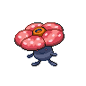
  </pokemon-card>

  <pokemon-card name="Victreebel" level="Leaf Stone" types="grass, poison" compact>
    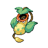
  </pokemon-card>

  <pokemon-card name="Exeggutor" level="Leaf Stone" types="grass, psychic" compact>
    
  </pokemon-card>

  <pokemon-card name="Shiftry" level="Leaf Stone" types="grass, dark" compact>
    
  </pokemon-card>
</pokemon-showcase>

- **Gloom ➔ Vileplume (FireRed Exclusive)**: Master of status affliction with _Sleep Powder_ and sustain through _Giga Drain_.
- **Weepinbell ➔ Victreebel (LeafGreen Exclusive)**: High mixed offensive stats with _Sludge Bomb_ and _Razor Leaf_.
- **Exeggcute ➔ Exeggutor**: One of the strongest Pokémon in Kanto, bringing massive Special Attack, psychic typing, and _Explosion_.
- **Nuzleaf ➔ Shiftry (National Dex)**: Dual Grass/Dark typing to threaten Psychic and Ghost types.

---

### 2.5. Moon Stone

A cosmic mineral awakening nocturnal power and royal battle prowess.

<pokemon-showcase>
  <pokemon-card name="Nidoqueen" level="Moon Stone" types="poison, ground" compact>
    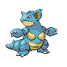
  </pokemon-card>

  <pokemon-card name="Nidoking" level="Moon Stone" types="poison, ground" compact>
    
  </pokemon-card>

  <pokemon-card name="Clefable" level="Moon Stone" types="normal" compact>
    
  </pokemon-card>

  <pokemon-card name="Wigglytuff" level="Moon Stone" types="normal" compact>
    
  </pokemon-card>

  <pokemon-card name="Delcatty" level="Moon Stone" types="normal" compact>
    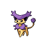
  </pokemon-card>
</pokemon-showcase>

- **Nidorina ➔ Nidoqueen & Nidorino ➔ Nidoking**: Unrivaled TM versatility (Earthquake, Ice Beam, Thunderbolt, Flamethrower, Surf, Megahorn). You can possess a fully evolved Nidoking or Nidoqueen before the 3rd Gym badge!
- **Clefairy ➔ Clefable**: Vast movepool combined with defensive stat boosters like _Cosmic Power_ and _Moonlight_.
- **Jigglypuff ➔ Wigglytuff**: A massive HP pool (140 base HP) capable of soaking substantial damage.
- **Skitty ➔ Delcatty (National Dex)**: Agile Normal-type utility supporter.

---

### 2.6. Sun Stone

Harnessing solar rays to bloom into cheerful, radiant forms.

<pokemon-showcase>
  <pokemon-card name="Bellossom" level="Sun Stone" types="grass" compact>
    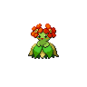
  </pokemon-card>

  <pokemon-card name="Sunflora" level="Sun Stone" types="grass" compact>
    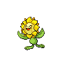
  </pokemon-card>
</pokemon-showcase>

- **Gloom ➔ Bellossom**: Sheds the secondary Poison typing to become a pure Grass-type with 100 base Special Defense and _Teeter Dance_.
- **Sunkern ➔ Sunflora (National Dex)**: Powerful _Solar Beam_ cannon under bright sun.

---

## 3. Where to Find Every Evolutionary Stone in Kanto

Avoid wandering aimlessly; here is the complete supply checklist for your journey:

| Evolutionary Stone | Main Location in FireRed / LeafGreen                                   | Purchasable? |
| :----------------- | :--------------------------------------------------------------------- | :----------- |
| **Fire Stone**     | Celadon Department Store (4F)                                          | Yes ($2,100) |
| **Water Stone**    | Celadon Department Store (4F) & Route 25                               | Yes ($2,100) |
| **Thunder Stone**  | Celadon Department Store (4F) & Power Plant                            | Yes ($2,100) |
| **Leaf Stone**     | Celadon Department Store (4F) & Safari Zone                            | Yes ($2,100) |
| **Moon Stone**     | Mt. Moon (x2), Rocket Hideout, Pokémon Mansion, and wild Clefairy (5%) | No (Finite)  |
| **Sun Stone**      | Ruin Valley (Six Island) on ground, or held by wild Meowth/Solrock     | No (Finite)  |

> **PokeForge Tip**: Because Fire, Water, Thunder, and Leaf Stones are infinitely purchasable in Celadon City, spend your prize money freely once your pre-evolved Pokémon have learned their required moves! However, hoard your **Moon Stones** carefully, as there are only 4 fixed pickups in the main story before you have to farm wild Clefairies using _Thief_.

---

## Conclusion

Mastering trade and stone evolutions in **Pokémon FireRed & LeafGreen** is the key to building an unstoppable championship squad for the Indigo Plateau and the Sevii Islands.

Have you decided whether your Eevee will become a swift Jolteon or a bulky Vaporeon? Test out combinations in **PokeForge's Team Builder** to analyze weaknesses and coverage in real time!
