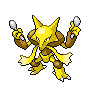
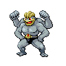
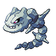
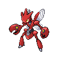
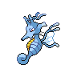
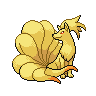
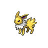
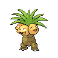
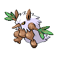
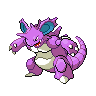

Todos recordamos la época dorada de **Pokémon Rojo Fuego y Verde Hoja** (_FireRed & LeafGreen_). Tenías tu equipo soñado en mente, subías a tu Kadabra o a tu Haunter con sudor y lágrimas al nivel 60 pensando: _"seguro que al siguiente nivel evoluciona"_, solo para descubrir la dura realidad: **Game Freak quería que tuvieras amigos en la vida real**.

Y si no era el drama de conseguir a alguien con una Game Boy Advance y un Cable Link que no se desconectara si alguien respiraba cerca, era la tragedia de comprar una Piedra Fuego en el Centro Comercial de Ciudad Azulona, usarla inmediatamente en tu Growlithe de nivel 18 y condenarlo a no aprender _Lanzallamas_ por el resto de su existencia.

En esta guía repasamos a fondo todos los Pokémon que evolucionan mediante **Intercambio** y **Piedras Evolutivas** en Rojo Fuego y Verde Hoja, sus particularidades competitivas y dónde conseguir cada objeto sin caer en la bancarrota.

---

## 1. Evoluciones por Intercambio (Trade Evolutions)

El intercambio ha sido desde 1996 el mayor filtro de amistad en los videojuegos. En Rojo Fuego y Verde Hoja, las evoluciones por intercambio se dividen en dos categorías: las clásicas de Kanto (sin objeto) y las introducidas con la Pokédex Nacional (con objeto equipado).

> **Alerta de Trauma Clásico**: Nunca olvides la regla no escrita del patio del colegio: si le prestabas tu Machoke o Haunter a un amigo para que evolucionara, existía un 50% de probabilidad de que el amigo fingiera que "su madre lo llamaba" y se fuera corriendo con tu flamante Gengar o Machamp. (O peor aún, los antecesores espirituales de Gaspar en Sinnoh, el infame NPC que te cambiaba un Haunter con _Piedra Eterna_ equipada).

### 1.1. Intercambio Clásico (Sin Objeto)

Estos cuatro titanes de la primera generación evolucionan de manera inmediata al ser transferidos a otro cartucho (o emulador con conexión inalámbrica/link):

<pokemon-showcase>
  <pokemon-card name="Alakazam" level="Intercambio" types="psiquico" compact>
    
  </pokemon-card>

  <pokemon-card name="Machamp" level="Intercambio" types="lucha" compact>
    
  </pokemon-card>

  <pokemon-card name="Golem" level="Intercambio" types="roca, tierra" compact>
    
  </pokemon-card>

  <pokemon-card name="Gengar" level="Intercambio" types="fantasma, veneno" compact>
    
  </pokemon-card>
</pokemon-showcase>

- **Kadabra ➔ Alakazam**: Una auténtica bestia con Ataque Especial y Velocidad descomunales. En tercera generación, sus _Puños Elementales_ (Fuego, Hielo, Trueno) eran considerados ataques especiales, convirtiéndolo en un cañón de cobertura demoledor.
- **Machoke ➔ Machamp**: Cuatro brazos listos para repartir _Tajo Cruzado_. Su habilidad _Agallas_ duplica su ya monstruoso Ataque físico si sufre un problema de estado como quemadura o parálisis.
- **Graveler ➔ Golem**: El tanque de combate por excelencia. En la aventura te salvará contra el Teniente Surge y Blaine, y su _Explosión_ es el botón de pánico más destructivo del juego.
- **Haunter ➔ Gengar**: Con la habilidad _Levitación_, Gengar anula por completo su debilidad a Tierra (Terremoto) y se vuelve inmune a Normal, Lucha y Tierra. El rey de las batallas tácticas de Kanto.

---

### 1.2. Intercambio con Objeto Equipado (Pokédex Nacional)

> **Importante para Rojo Fuego y Verde Hoja**: Estas evoluciones pertenecen a la **Pokédex Nacional**. Para poder realizarlas en RF/VH, necesitas haber vencido al Alto Mando, haber capturado al menos 60 especies de Pokémon distintas y haberle entregado el **Rubí** y el **Zafiro** a Celio en Isla Prima (Islas Sete) para conectar la máquina de redes con Hoenn. Si intentas intercambiar un Scyther con Revestimiento Metálico antes de desbloquear la Dex Nacional, la evolución se cancelará automáticamente con un mensaje misterioso de interrupción.

<pokemon-showcase>
  <pokemon-card name="Steelix" level="Rev. Metálico" types="acero, tierra" compact>
    
  </pokemon-card>

  <pokemon-card name="Scizor" level="Rev. Metálico" types="bicho, acero" compact>
    
  </pokemon-card>

  <pokemon-card name="Kingdra" level="Escama Dragón" types="agua, dragon" compact>
    
  </pokemon-card>

  <pokemon-card name="Politoed" level="Roca del Rey" types="agua" compact>
    
  </pokemon-card>

  <pokemon-card name="Slowking" level="Roca del Rey" types="agua, psiquico" compact>
    
  </pokemon-card>

  <pokemon-card name="Porygon2" level="Mejora" types="normal" compact>
    
  </pokemon-card>

  <pokemon-card name="Huntail" level="Diente Marino" types="agua" compact>
    
  </pokemon-card>

  <pokemon-card name="Gorebyss" level="Escama Marina" types="agua" compact>
    
  </pokemon-card>
</pokemon-showcase>

#### Dónde encontrar los objetos de evolución por intercambio:

- **Revestimiento Metálico (_Metal Coat_)**: Isla Quinta (Memorial Pilar) entregando una Limonada al hombre que llora a su Onix (_Tectonix_), o salvaje equipado en Magnemite/Magneton salvajes (5% de probabilidad).
- **Escama Dragón (_Dragon Scale_)**: Cueva Glaciada (Isla Quarta) en el suelo, o equipado raramente en Horsea/Seadra/Dratini/Dragonair salvajes.
- **Roca del Rey (_King's Rock_)**: Isla Sétima (Cañón Sétimo) y equipada en Poliwhirl o Slowpoke salvajes.
- **Mejora (_Up-Grade_)**: Guarida Rocket de Isla Quinta.
- **Diente Marino (_Deep Sea Tooth_)** y **Escama Marina (_Deep Sea Scale_)**: Obtenibles transfiriéndolos desde Pokémon Rubí/Zafiro/Esmeralda mediante el barco S.S. Marea / Nao Abandonada.

---

## 2. Evoluciones por Piedras Evolutivas (Evolutionary Stones)

Las piedras evolutivas son la forma más rápida y directa de mutar a tus Pokémon... pero conllevan una **trampa mortal** en la 3ª Generación:

> **¡Cuidado con el set de movimientos!**: En Pokémon Rojo Fuego y Verde Hoja, la inmensa mayoría de Pokémon que evolucionan por piedra **dejan de aprender movimientos por nivel** de forma casi absoluta.
>
> - Si evolucionas a **Pikachu** en Raichu en el nivel 5, Raichu jamás aprenderá _Rayo_, _Agilidad_ o _Onda Trueno_ por nivel.
> - Si evolucionas a **Growlithe** antes del nivel 49, Arcanine nunca aprenderá _Lanzallamas_ de forma natural (y tendrás que gastar la costosa MT35 del Casino).
> - **Regla de Oro**: Revisa la lista de ataques en PokeForge antes de tocar esa piedra evolutiva en tu mochila.

### 2.1. Piedra Agua (Water Stone)

La piedra que convierte a simpáticas criaturas acuáticas en auténticas murallas defensivas y ofensivas.

<pokemon-showcase>
  <pokemon-card name="Poliwrath" level="Piedra Agua" types="agua, lucha" compact>
    
  </pokemon-card>

  <pokemon-card name="Cloyster" level="Piedra Agua" types="agua, hielo" compact>
    
  </pokemon-card>

  <pokemon-card name="Starmie" level="Piedra Agua" types="agua, psiquico" compact>
    
  </pokemon-card>

  <pokemon-card name="Vaporeon" level="Piedra Agua" types="agua" compact>
    
  </pokemon-card>

  <pokemon-card name="Ludicolo" level="Piedra Agua" types="agua, planta" compact>
    
  </pokemon-card>
</pokemon-showcase>

- **Poliwhirl ➔ Poliwrath**: Añade el tipo Lucha secundario y un bulk físico considerable.
- **Shellder ➔ Cloyster**: Una de las mayores estadísticas de Defensa física de todo el juego (base 180), además del acceso táctico a _Púas_ y _Explosión_.
- **Staryu ➔ Starmie**: Una de las estrellas absolutas de Kanto. Acceso a _Surf_, _Psíquico_, _Rayo_, _Rayo Hielo_ y _Recuperación_. ¡Un atacante rápido perfecto para pasar la Liga!
- **Eevee ➔ Vaporeon**: Gigante tanque especial con unos impresionantes 130 puntos de PS base.
- **Lombre ➔ Ludicolo (Dex Nacional)**: Una combinación de tipos única (Agua/Planta) que anula debilidades clásicas de ambos elementos.

---

### 2.2. Piedra Fuego (Fire Stone)

El fuego de Kanto arde con fuerza gracias a esta piedra.

<pokemon-showcase>
  <pokemon-card name="Ninetales" level="Piedra Fuego" types="fuego" compact>
    
  </pokemon-card>

  <pokemon-card name="Arcanine" level="Piedra Fuego" types="fuego" compact>
    
  </pokemon-card>

  <pokemon-card name="Flareon" level="Piedra Fuego" types="fuego" compact>
    
  </pokemon-card>
</pokemon-showcase>

- **Vulpix ➔ Ninetales (Exclusivo de Verde Hoja)**: Gran velocidad y capacidad de soporte mediante _Fuego Fatuo_ e hipnosis/confusión.
- **Growlithe ➔ Arcanine (Exclusivo de Rojo Fuego)**: Considerado el "pseudo-legendario" no oficial de Kanto por sus altísimas estadísticas base (555 puntos totales) y la formidable habilidad _Intimidación_.
- **Eevee ➔ Flareon**: Ataque físico demoledor (130 base), aunque en Gen 3 sus ataques de fuego dependían del Ataque Especial (95 base). ¡Aun así, un golpeador tremendo con _Bola Sombra_ y _Retribución_!

---

### 2.3. Piedra Trueno (Thunder Stone)

¡Energía eléctrica pura a golpe de mineral!

<pokemon-showcase>
  <pokemon-card name="Raichu" level="Piedra Trueno" types="electrico" compact>
    
  </pokemon-card>

  <pokemon-card name="Jolteon" level="Piedra Trueno" types="electrico" compact>
    
  </pokemon-card>
</pokemon-showcase>

- **Pikachu ➔ Raichu**: El fiel compañero de la mascota de la franquicia. Mejora notablemente su Velocidad y Ataque físico/especial respecto a Pikachu. (Asegúrate de haber aprendido _Rayo_ a nivel 26 con Pikachu antes de evolucionarlo).
- **Eevee ➔ Jolteon**: 130 de Velocidad base y 110 de Ataque Especial. Supera en velocidad a casi todo Kanto y es el terror de los Pokémon tipo Agua y Volador.

---

### 2.4. Piedra Hoja (Leaf Stone)

La flora de Kanto desata su poder venenoso y psíquico.

<pokemon-showcase>
  <pokemon-card name="Vileplume" level="Piedra Hoja" types="planta, veneno" compact>
    
  </pokemon-card>

  <pokemon-card name="Victreebel" level="Piedra Hoja" types="planta, veneno" compact>
    
  </pokemon-card>

  <pokemon-card name="Exeggutor" level="Piedra Hoja" types="planta, psiquico" compact>
    
  </pokemon-card>

  <pokemon-card name="Shiftry" level="Piedra Hoja" types="planta, siniestro" compact>
    
  </pokemon-card>
</pokemon-showcase>

- **Gloom ➔ Vileplume (Exclusivo de Rojo Fuego)**: La flor tóxica por excelencia, ideal para inducir estados alterados con _Somnífero_ y drenar vida.
- **Weepinbell ➔ Victreebel (Exclusivo de Verde Hoja)**: Ofensiva mixta brutal con _Hoja Afilada_ y _Bomba Lodo_.
- **Exeggcute ➔ Exeggutor**: Uno de los mejores Pokémon de Kanto. Gran Ataque Especial, tipo Psíquico demoledor y acceso a _Explosión_.
- **Nuzleaf ➔ Shiftry (Dex Nacional)**: Interesante adición de tipo Siniestro para contrarrestar fantasmas y psíquicos.

---

### 2.5. Piedra Lunar (Moon Stone)

Un mineral místico caído del espacio exterior que despierta el potencial oculto de especies nocturnas y de la realeza de Kanto.

<pokemon-showcase>
  <pokemon-card name="Nidoqueen" level="Piedra Lunar" types="veneno, tierra" compact>
    
  </pokemon-card>

  <pokemon-card name="Nidoking" level="Piedra Lunar" types="veneno, tierra" compact>
    
  </pokemon-card>

  <pokemon-card name="Clefable" level="Piedra Lunar" types="normal" compact>
    
  </pokemon-card>

  <pokemon-card name="Wigglytuff" level="Piedra Lunar" types="normal" compact>
    
  </pokemon-card>

  <pokemon-card name="Delcatty" level="Piedra Lunar" types="normal" compact>
    
  </pokemon-card>
</pokemon-showcase>

- **Nidorina ➔ Nidoqueen & Nidorino ➔ Nidoking**: El dúo real más versátil del juego. Pueden aprender prácticamente cualquier MT (Terremoto, Rayo Hielo, Rayo, Lanzallamas, Surf, Megacuerno). ¡Puedes tener un Nidoking o Nidoqueen completamente evolucionado antes del 3er gimnasio si recoges la Piedra Lunar del Monte Moon!
- **Clefairy ➔ Clefable**: Enorme repertorio de movimientos y acceso a _Masa Cósmica_ y _Luz Lunar_.
- **Jigglypuff ➔ Wigglytuff**: Una esponja de puntos de salud con 140 de PS base.
- **Skitty ➔ Delcatty (Dex Nacional)**: Pokémon ágil de tipo Normal.

---

### 2.6. Piedra Solar (Sun Stone)

La piedra que absorbe los rayos del astro rey para florecer en formas alegres y luminosas.

<pokemon-showcase>
  <pokemon-card name="Bellossom" level="Piedra Solar" types="planta" compact>
    
  </pokemon-card>

  <pokemon-card name="Sunflora" level="Piedra Solar" types="planta" compact>
    
  </pokemon-card>
</pokemon-showcase>

- **Gloom ➔ Bellossom**: A diferencia de Vileplume, Bellossom pierde el tipo Veneno secundario para convertirse en tipo Planta puro con altísima Defensa Especial (100 base) y la divertida técnica _Danza Caos_.
- **Sunkern ➔ Sunflora (Dex Nacional)**: Se nutre del sol para lanzar demoledores _Rayos Solares_ bajo clima soleado.

---

## 3. ¿Dónde conseguir cada Piedra Evolutiva en Kanto?

No todas las piedras crecen en los árboles; aquí tienes el mapa de suministros para tu aventura:

| Piedra Evolutiva  | Ubicación Principal en Rojo Fuego / Verde Hoja                                                        | ¿Se puede comprar? |
| :---------------- | :---------------------------------------------------------------------------------------------------- | :----------------- |
| **Piedra Fuego**  | Centro Comercial de Ciudad Azulona (Piso 4)                                                           | Sí ($2,100)        |
| **Piedra Agua**   | Centro Comercial de Ciudad Azulona (Piso 4) y Ruta 25                                                 | Sí ($2,100)        |
| **Piedra Trueno** | Centro Comercial de Ciudad Azulona (Piso 4) y Central de Energía                                      | Sí ($2,100)        |
| **Piedra Hoja**   | Centro Comercial de Ciudad Azulona (Piso 4) y Zona Safari                                             | Sí ($2,100)        |
| **Piedra Lunar**  | Monte Moon (x2), Guarida Rocket, Mansión Pokémon de Isla Canela, y equipada en Clefairy salvajes (5%) | No (Limitadas)     |
| **Piedra Solar**  | Valle Ruinas (Isla Sexta) en el suelo, o equipada en Meowth/Solrock salvajes                          | No (Limitadas)     |

> **Consejo PokeForge**: Dado que las Piedras Fuego, Agua, Trueno y Hoja son de compra infinita en Ciudad Azulona, ¡no tengas miedo de gastar tu dinero una vez que tus Pokémon hayan aprendido todos los movimientos necesarios! Pero administra con cuidado tus **Piedras Lunares**, ya que en la historia principal solo hay 4 fijas en el suelo antes de tener que farmear Clefairies salvajes con _Ladrón_.

---

## Conclusión

Dominar los métodos de evolución por intercambio y piedras en **Pokémon Rojo Fuego y Verde Hoja** te permitirá armar una alineación legendaria para conquistar la Liga Pokémon y los secretos de las Islas Sete.

¿Ya elegiste si tu Eevee será un veloz Jolteon o un resistente Vaporeon? ¡Pruébalo en la herramienta de equipo de **PokeForge** para calcular sus debilidades y coberturas en tiempo real!
