## 1.0: Pueblo Paleta

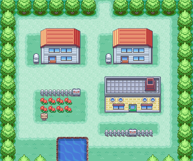
_Mapa de Pueblo Paleta_

### Objetos

| Objeto         | Tipo       | Ubicación                                         |
| -------------- | ---------- | ------------------------------------------------- |
| Poción         | Oculto     | En el PC de tu habitación (arriba a la izquierda) |
| Pokédex        | Clave      | Te la da el Prof. Oak al entregarle su paquete    |
| Poké Ball (x5) | Consumible | Te las da el Prof. Oak con la Pokédex             |
| Mapa           | Clave      | Habla con Dalia (casa de arriba del laboratorio)  |

Tu aventura da inicio en tu habitación en **Pueblo Paleta**.

> Antes de iniciar tu aventura bajando las escaleras, te encontrarás con el primer secreto. Si interactúas con el PC de arriba a la izquierda, dentro del almacenamiento de objetos podrás recibir una poción.

Tras bajar por las escaleras y despedirte de tu madre, dirígete hacia la salida norte (la salida de arriba) del pueblo, donde el **Profesor Oak** te detendrá advirtiéndote del peligro de cruzar la hierba alta sin compañía, te escoltará hasta el laboratorio y te permitirá elegir tu Pokémon inicial.

---

## 1.1: La Elección del Pokémon Inicial

En el laboratorio de Oak tendrás que tomar tu primera gran decisión:

<pokemon-showcase>
  <pokemon-card
    name="Bulbasaur"
    level="Nv. 5"
    types="planta, veneno"
    moves="Placaje, Gruñido">
    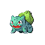
  </pokemon-card>

<pokemon-card
    name="Charmander"
    level="Nv. 5"
    types="fuego"
    moves="Arañazo, Gruñido">
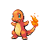
</pokemon-card>

<pokemon-card
    name="Squirtle"
    level="Nv. 5"
    types="agua"
    moves="Placaje, Látigo">
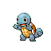
</pokemon-card>
</pokemon-showcase>

- **Bulbasaur**: es el más fácil de entrenar y además tiene ventaja de tipo en los dos primeros gimnasios y también en el último. Además, no le afecta mucho el tercero (tipo Eléctrico) ni el cuarto (tipo Planta). Tiene debilidad ante el gimnasio de Sabrina (debido a que Bulbasaur es también tipo Veneno y tiene desventaja frente al tipo Psíquico) y en el séptimo gimnasio (tipo Fuego).
  Además, al elegir a Bulbasaur aparecerá Entei por las rutas de Kanto de forma aleatoria.
- **Squirtle**: es la opción intermedia en cuanto a entrenamiento y gana en el primer gimnasio, el séptimo y el octavo. Tiene debilidad ante el tercer y cuarto gimnasio.
  Además, al elegir a Squirtle aparecerá Raikou por las rutas de Kanto de forma aleatoria.
- **Charmander**: es el más difícil de entrenar y te será difícil ganar en los dos primeros gimnasios, tercero, séptimo y octavo (aunque en el primero no tanto si aprendió Garra Metal). Tiene ventaja en el cuarto gimnasio, y en el de Sabrina le será fácil derrotar a Venomoth sin mayores problemas contra los demás.
  Además, al elegir a Charmander aparecerá Suicune por las rutas de Kanto de forma aleatoria.

> **Consejo**: Tu rival elegirá automáticamente el inicial que tiene ventaja de tipo sobre el tuyo. Inmediatamente después tendrás tu primer combate. Usa ataques directos como _Placaje_ o _Arañazo_ sin dudar.

Al ganar el combate también ganarás dinero (si llegases a perder, el Prof. Oak le dará a tu rival el dinero por ser tu primer combate) y podrás iniciar la aventura.

---

## 1.2: La Ruta 1 y la Entrega del Paquete

Avanza hacia el norte a través de la **Ruta 1**, allí encontrarás:

### Encuentros salvajes

<pokemon-showcase>
  <pokemon-card name="Rattata" level="Nv. 2-4" types="normal" compact>
    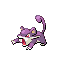
  </pokemon-card>

  <pokemon-card name="Pidgey" level="Nv. 2-5" types="normal, volador" genero="f" compact>
    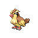
  </pokemon-card>
</pokemon-showcase>

Por el momento no cuentas con Poké Balls, así que aprovecha estos combates únicamente para ganar puntos de experiencia.

### Objetos

| Objeto            | Tipo       | Ubicación                                                                                                                                        |
| ----------------- | ---------- | ------------------------------------------------------------------------------------------------------------------------------------------------ |
| Poción de Muestra | Consumible | Habla con el encargado de la tienda que pasea por la ruta para recibir una _Poción_ gratuita. Es la primera persona que ves al salir del pueblo. |

## 1.2.1: Visita rápida a Ciudad Verde

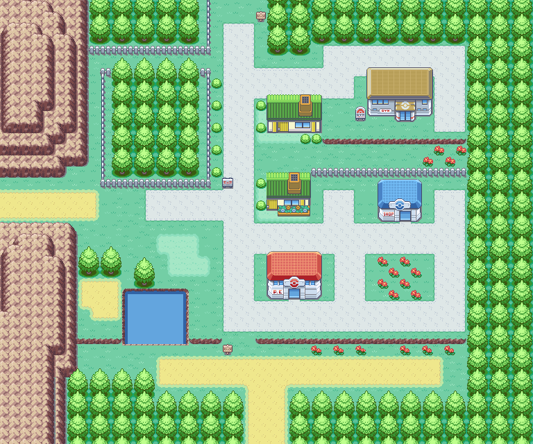
_Mapa de Ciudad Verde_

Al llegar a **Ciudad Verde**, cura a tus Pokémon en el **Centro Pokémon** y entra en la Tienda Pokémon (_Poké Mart_). El vendedor te pedirá que le lleves un paquete especial al Profesor Oak.

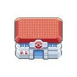
_Centro Pokémon_

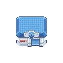
_Tienda_

> En el Centro Pokémon verás que hay un segundo piso. Allí, Teala, la encargada del sistema inalámbrico, te explicará el funcionamiento de este sistema: cómo funciona la Sala Unión y el Centro de Cambio.
> Si estás jugando en una Game Boy Advance, vas a necesitar por supuesto un **cable link**, pero si estás jugando desde la versión de Nintendo Switch, se haría por conexión LAN o internet.

Regresa a Pueblo Paleta y entrégale el encargo. Al hacerlo entrará tu rival y el Prof. Oak les recompensará oficialmente con sus **Pokédex** y sus primeras 5 **Poké Balls**. Luego, tu rival te hablará sobre su hermana (_Dalia_) y que ella posee un mapa.
La casa de Dalia es la que está justo detrás del laboratorio. Ve a hablar con ella para obtener el mapa (te servirá para saber dónde estás) y vuelve a **Ciudad Verde**.

## 1.3: Ciudad Verde

Ahora sí, ya estamos en Ciudad Verde. Aquí encontrarás varios edificios, pero los más importantes son el Centro Pokémon, la Tienda y el Gimnasio. Este último estará cerrado, ya que aquí se ganará la octava medalla.

**Tienda**

| Objeto        | Precio |
| :------------ | -----: |
| Poké Ball     |   $200 |
| Poción        |   $300 |
| Antídoto      |   $100 |
| Antiparálisis |   $200 |

**Objetos**

| Objeto               | Tipo       | Ubicación                                                   |
| -------------------- | ---------- | ----------------------------------------------------------- |
| Poción               | Consumible | Árboles vallados hacia la Ruta 22.                          |
| Correo del Prof. Oak | Clave      | Habla con el chico de la Tienda.                            |
| Pokétele             | Clave      | Te la da el señor que impide el paso al salir de la ciudad. |

En esta ciudad encontrarás los siguientes Pokémon pescando o surfeando:

<pokemon-showcase>
  <pokemon-card name="Psyduck" level="Nv. 15-35" types="agua" compact>
    
  </pokemon-card>

  <pokemon-card name="Slowpoke" level="Nv. 15-25" types="agua, psiquico" compact>
    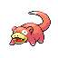
  </pokemon-card>

  <pokemon-card name="Magikarp" level="Nv. 5-15" types="agua" compact>
    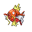
  </pokemon-card>

  <pokemon-card name="Poliwag" level="Nv. 5-25" types="agua" compact>
    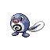
  </pokemon-card>

  <pokemon-card name="Goldeen" level="Nv. 5-15" types="agua" compact>
    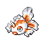
  </pokemon-card>

  <pokemon-card name="Poliwhirl" level="Nv. 20-30" types="agua" compact>
    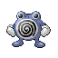
  </pokemon-card>

  <pokemon-card name="Gyarados" level="Nv. 15-25" types="agua, volador" compact>
    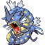
  </pokemon-card>
</pokemon-showcase>

> Es aconsejable que captures algunos Pokémon y los subas de nivel antes de ir a la Ruta 22.

## 1.4: Ruta 22

Esta ruta conecta Ciudad Verde con la Liga Pokémon y aquí podrás encontrar los siguientes Pokémon:

<pokemon-showcase>
  <pokemon-card name="Rattata" level="Nv. 2-5" types="normal" compact>
    
  </pokemon-card>

  <pokemon-card name="Spearow" level="Nv. 3-5" types="normal, volador" compact>
    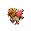
  </pokemon-card>

  <pokemon-card name="Mankey" level="Nv. 2-5" types="lucha" compact>
    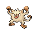
  </pokemon-card>
</pokemon-showcase>

También surfeando podrás atrapar a **Psyduck** y **Slowpoke**, aunque tendrás que esperar para ello porque la **MO03: Surf** se obtiene más adelante en la historia. También puedes conseguir a Magikarp, Poliwag, Goldeen, Poliwhirl y Gyarados utilizando las cañas que obtendrás próximamente.

Al pasar las hierbas altas verás un camino. Al continuar por ese camino, tendrás el segundo encuentro contra tu rival. Si seguiste el consejo anterior y entrenaste a tus Pokémon, no tendrás problemas, ya que al ser todavía el inicio tendrá niveles bajos.

### Equipo de tu rival

<rival-selector></rival-selector>

<pokemon-showcase>
<rival-slot>
<pokemon-card for="bulbasaur" 
name="Charmander" 
level="Nv. 9" 
types="fuego"
ability="Mar llamas"
moves="Arañazo, Gruñido, Ascuas, -">

</pokemon-card>

<pokemon-card for="charmander" 
name="Squirtle" 
level="Nv. 9" 
types="agua"
ability="Torrente"
moves="Placaje, Látigo, Burbuja,- ">

</pokemon-card>

<pokemon-card for="squirtle" 
name="Bulbasaur" 
level="Nv. 9" 
types="planta, veneno"
ability="Espesura"
moves="Placaje, Gruñido, Drenadoras, -">

</pokemon-card>
</rival-slot>

<pokemon-card name="Pidgey" 
level="Nv. 9" 
types="normal, volador" 
ability="Vista lince"
moves="Placaje, Ráfaga de aire, Ataque arena, -">

</pokemon-card>
</pokemon-showcase>

Si al derrotar a tu rival sigues por el camino llegarás a la Liga Pokémon, aunque no podrás entrar todavía por falta de medallas. Vuelve a Ciudad Verde y ve hacia la parte norte; allí estará un señor que te detendrá, te dará el tutorial de captura de Pokémon y te entregará la Pokétele.

> La Pokétele es un Objeto Clave que al usarla te dirá tips y consejos para tu aventura.

---

## Ruta 2

Esta ruta comunica [Ciudad Verde](#13-ciudad-verde) con **Ciudad Plateada**, pasando antes por el **Bosque Verde**. En esta ruta podrás capturar:

<pokemon-showcase>
	<pokemon-card
	  name="Caterpie"
	  level="Nv. 4-5"
	  types="bicho"
	  compact>	
	  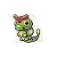
	</pokemon-card>

    <pokemon-card
      name="Weedle"
      level="Nv. 4-5"
      types="bicho, veneno"
      compact>
      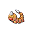
    </pokemon-card>

    <pokemon-card
      name="Pidgey"
      level="Nv. 2-5"
      types="normal, volador"
      compact>
      
    </pokemon-card>

    <pokemon-card
      name="Rattata"
      level="Nv. 2-5"
      types="normal"
      compact>
      
    </pokemon-card>

</pokemon-showcase>

> Antes de tu primer reto, es recomendable que compres en la Tienda antídotos para curar el envenenamiento y algunas Poké Balls, que te ayudarán a vencer próximamente a Brock.

## 📋 Checklist de Objetos

Antes de continuar, ¿has recogido los objetos de la zona? Aquí te recuerdo cuáles hay:

- [ ] **Poción** — PC de tu habitación (Pueblo Paleta)
- [ ] **Pokédex** — Entrega de Oak (Laboratorio)
- [ ] **Poké Ball (×5)** — Entrega de Oak (Laboratorio)
- [ ] **Mapa** — Regalo de Dalia (Pueblo Paleta)
- [ ] **Poción de muestra** — Vendedor de la Tienda (Ruta 1)
- [ ] **Poción oculta** — Árboles cercados al noroeste (Ciudad Verde)

## Próximo Objetivo: Bosque Verde
